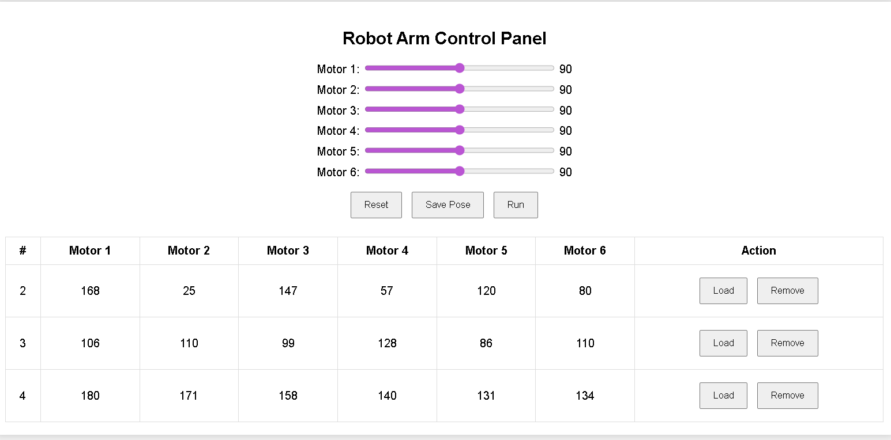

# Robot Arm Web Control Panel

A web-based control interface for a 6-DOF robot arm using HTML, CSS, JavaScript, PHP, and MySQL (XAMPP). This interface allows you to control six motors (servos), save their positions (poses), and reload them later.



##  Features

- Interactive control sliders (movable range 0-180)
- Save pose (motor positions) to MySQL database
- Load pose from database to sliders
- Delete poses from table
- Designed with XAMPP for easy local deployment

---

##  Project Structure

```
robot-arm-web-control/
│
├── index.php
├── save_pose.php
├── get_run_pose.php
├── load_pose.php
├── remove_pose.php
├── update_status.php
├── robot_arm_ui_preview.png
└── README.md
```

---

##  Database Setup

1. Open `http://localhost/phpmyadmin`
2. Create a new database named: `robot_arm`
3. Inside it, create a table called `poses` with 8 columns:

| Column Name | Type | Length | Extra          |
|-------------|------|--------|----------------|
| id          | INT  | 11     | Primary, Auto Increment |
| motor1      | INT  | 3      |                |
| motor2      | INT  | 3      |                |
| motor3      | INT  | 3      |                |
| motor4      | INT  | 3      |                |
| motor5      | INT  | 3      |                |
| motor6      | INT  | 3      |                |
| status      | INT  | 1      |                |

---

##  How to Use

1. Start Apache & MySQL from XAMPP
2. Go to `http://localhost/robot_arm` in your browser
3. Move sliders to desired servo angles
4. Click `Save Pose` to store position in database
5. Use `Load` button to apply saved pose to sliders
6. Click `Remove` to delete a pose

---

##  Technologies Used

- HTML + CSS (with `accent-color: mediumorchid` for sliders)
- JavaScript
- PHP
- MySQL via phpMyAdmin
- XAMPP (Apache + MySQL)


---

##  Future Additions

- Arduino connection (Serial/MQTT)
- Live pose preview
- Authentication & user-specific saving
